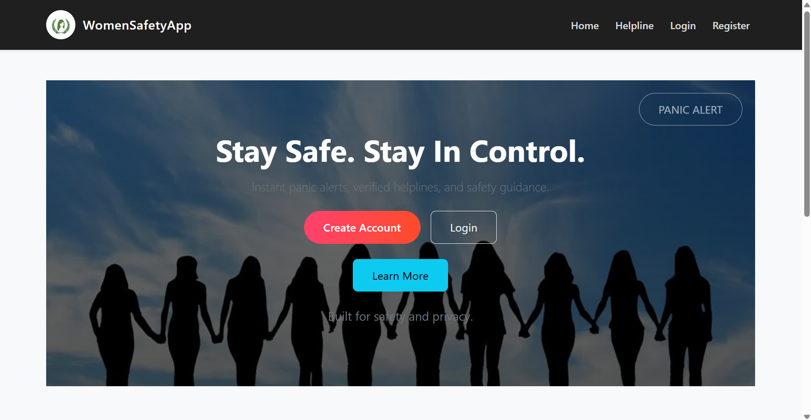
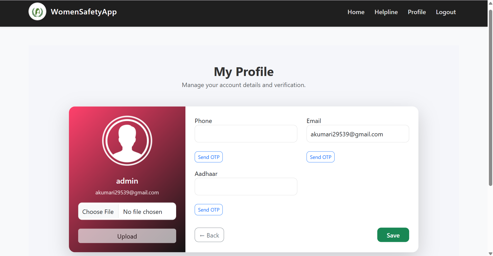
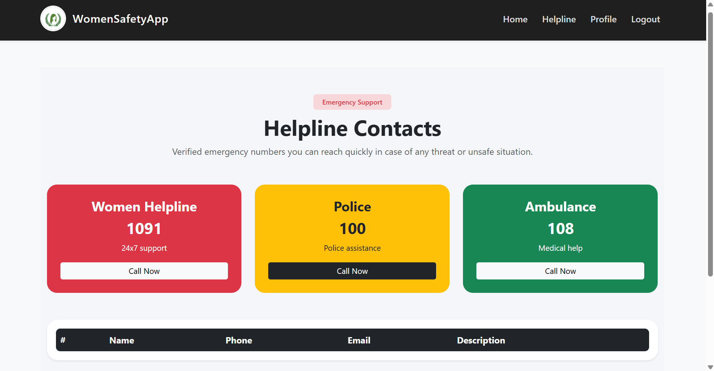
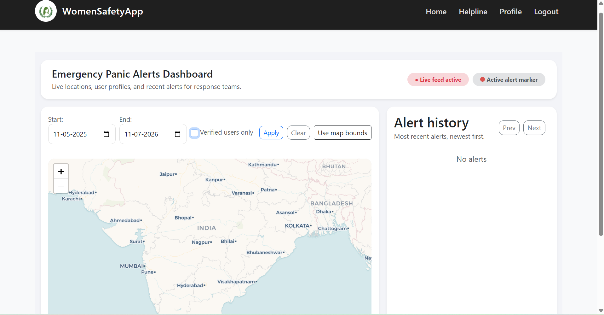
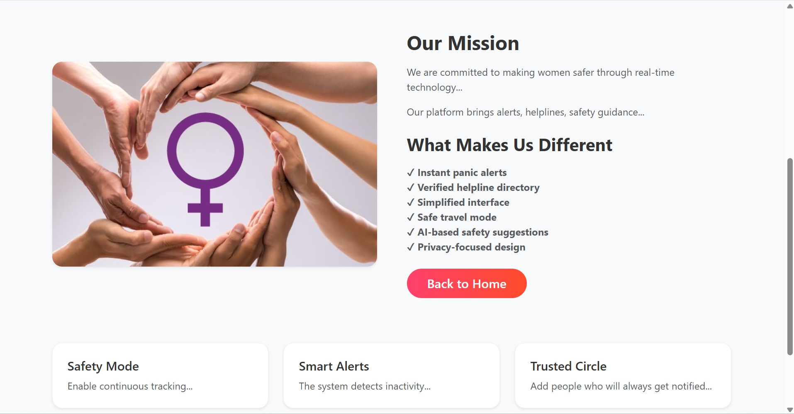

# 🚨 SheSafe – Women Safety Web Application

<p align="center">


</p>

A **full-stack Women Safety Web Application** built using **Django** to provide emergency assistance, secure authentication, live location support, and quick access to nearby emergency services. The platform aims to improve women's safety through technology by enabling users to seek help quickly and efficiently.

---

# 🌐 Live Demo

🔗 **https://womensafety-f5tl.onrender.com**

---

# 📖 Overview

SheSafe is a web application designed to enhance women's safety by providing emergency support, secure user authentication, location-based services, and quick access to nearby police stations and hospitals. The application focuses on delivering a simple, responsive, and reliable user experience during emergency situations.

---

# ✨ Features

### 🚨 Emergency Assistance
- Instant SOS support
- Emergency contact access
- Quick emergency response interface

### 🔐 Secure Authentication
- User Registration & Login
- OTP Verification using Twilio
- Secure Profile Management

### 📍 Location Services
- Nearby Police Stations
- Nearby Hospitals
- Google Maps Integration
- Real-time Navigation Support

### 👨‍💼 Admin Dashboard
- User Management
- Emergency Activity Monitoring
- Administrative Controls

### 📱 Responsive Design
- Mobile-Friendly Interface
- Simple & User-Friendly Design
- Responsive Layout

---

# 🛠️ Tech Stack

| Category | Technologies |
|----------|--------------|
| **Backend** | Python, Django |
| **Frontend** | HTML, CSS, JavaScript |
| **Database** | SQLite |
| **APIs** | Twilio API, Google Maps API |
| **Deployment** | Render |
| **Version Control** | Git & GitHub |

---

# 📸 Screenshots

## 🏠 Home Page



---

## 👤 Profile Page



---

## 🚨 Helpline Page



---

## ⚙️ Admin Dashboard



---

## ℹ️ About Page



---

# 📂 Project Structure

```text
womensafety/
│
├── core/
├── media/
├── screenshots/
├── staticfiles/
├── womensafety/
├── manage.py
├── requirements.txt
├── Procfile
├── README.md
└── LICENSE
```

---

# ⚙️ Installation

### Clone the Repository

```bash
git clone https://github.com/anshi26-cyber/womensafety.git
```

### Navigate to Project

```bash
cd womensafety
```

### Create a Virtual Environment

```bash
python -m venv venv
```

### Activate Virtual Environment

**Windows**

```bash
venv\Scripts\activate
```

**Linux / macOS**

```bash
source venv/bin/activate
```

### Install Dependencies

```bash
pip install -r requirements.txt
```

### Apply Migrations

```bash
python manage.py migrate
```

### Run the Development Server

```bash
python manage.py runserver
```

Open your browser and visit:

```
http://127.0.0.1:8000/
```

---

# 🔗 Third-Party Integrations

- 📍 Google Maps API
- 📱 Twilio API
- ☁️ Render Deployment

---

# 🚀 Future Enhancements

- 🤖 AI-powered safest route recommendation
- 🎤 Voice-activated SOS
- 📳 Shake detection for emergency alerts
- 📍 Real-time live location sharing
- 🔔 Push notifications
- 👮 Police emergency service integration
- 🌍 Multilingual support
- 💬 AI-powered emergency chatbot

---

# 💡 Challenges Faced

- Implementing secure OTP authentication
- Integrating third-party APIs
- Designing a responsive interface
- Managing user authentication and authorization
- Deploying a Django application on Render

---

# 📚 Learning Outcomes

This project helped me gain hands-on experience in:

- Full-Stack Web Development
- Django Framework
- Python Backend Development
- Django ORM
- Authentication & Authorization
- REST API Integration
- Google Maps API
- Twilio API
- Deployment using Render
- Git & GitHub

---

# 🤝 Contributing

Contributions are welcome!

1. Fork the repository
2. Create a new feature branch
3. Commit your changes
4. Push your branch
5. Open a Pull Request

---

# 📄 License

This project is licensed under the **MIT License**.

---

# 👩‍💻 Author

**Anshika Kumari**

🎓 B.Tech – Computer Science Engineering (AI & ML)

📧 **Email:** akumari29539@gmail.com

💼 **LinkedIn:** https://linkedin.com/in/anshika-kumari-7964b028a

💻 **GitHub:** https://github.com/anshi26-cyber

---

## ⭐ Support

If you found this project useful, please consider giving it a **⭐ Star** on GitHub.lding impactful tech solutions 🚀
